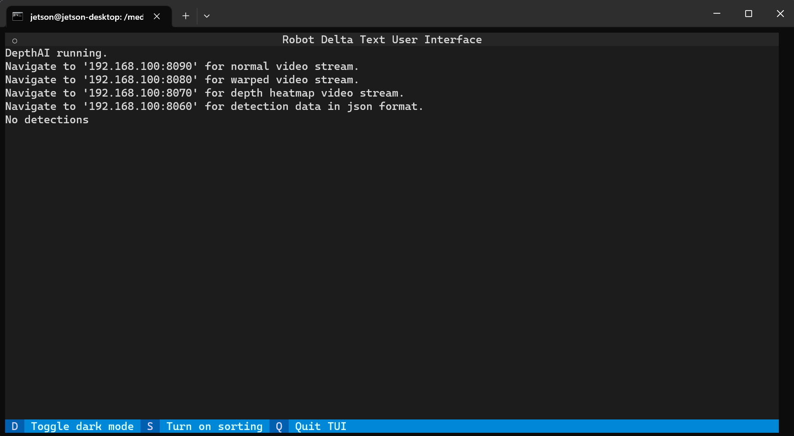
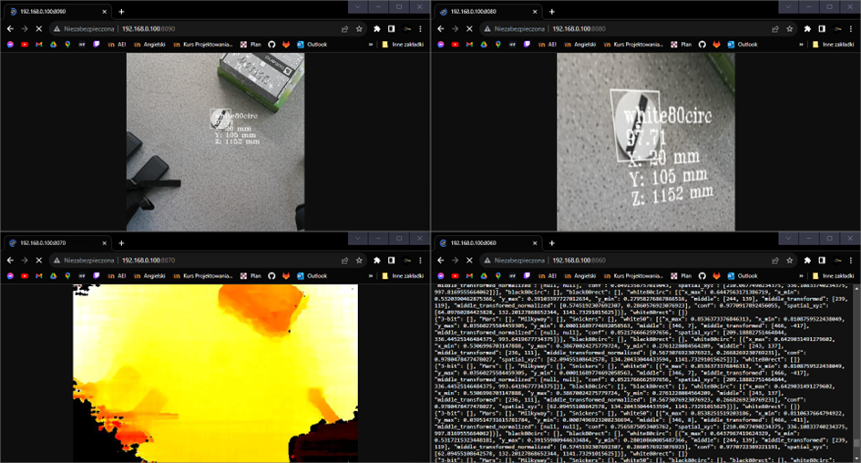

# Streaming OAK-D prediction and TCP communication with robot Delta
Stream OAK-D camera prediction while running a custom Yolov5 model
This repository is used for autonomous sorting of object recognized by the vision system of delta type robot

# TUI - Only Command Line Text User Interface 


# Video and JSON-format data from remote Jetson Nano host



# Installation
```python3 -m pip install -r requirements.txt```

# Run
```python3 app.py```

# Run options 

```"-d", "--device"``` Choose host: 0 - delta simulation, 1 - real delta<br />
```"-i", "--ip"``` Set http and json servers ip-s. The default ip would be localhost <br />
```"-p", "--preview"``` Choose preview: 0 - preview off, 1 - preview on <br />
```"-D", "--depth"``` Choose depth: 0 - depth off, 1 - depth on <br /> (depth off - boosts FPS)
               
# Running on with remote host using SSH HEADLESS
```python app.py --preview 0 --ip your_ip```<br />
```--preview 0``` will run app in HEADLESS mode<br />
```--ip your_ip ``` will set the ip where the video & JSON stream will be send  

# See result (Host must run Linux)
Video: [your_ip:8090](http://localhost:8090)

Warped video [your_ip:8080](http://localhost:8080)

Depth video  [your_ip:8070](http://localhost:8070)

Prediction: [localhost:8060](http://localhost:8060)


